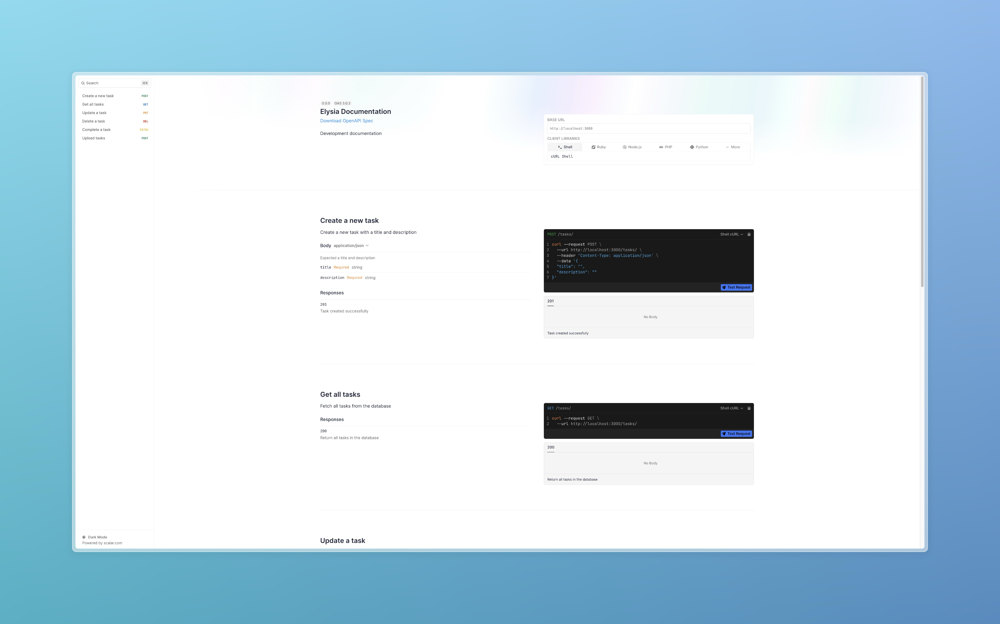

# Fundamentos do Node.js - Desafio Ignite



Este projeto é um desafio do curso Ignite da Rocketseat, de um desenvolvimento de uma API que realiza operações CRUD (Create, Read, Update, Delete) para gerenciamento de tasks. O objetivo é criar uma API completa que possibilite o cadastro, listagem, atualização e remoção de tasks, além de permitir a marcação de tasks como completas e o upload em massa de tarefas.

## Sobre o Projeto

A aplicação permite que os usuários:

- Criem uma task
- Listem todas as tasks
- Atualizem uma task pelo `id`
- Removam uma task pelo `id`
- Marquem pelo `id` uma task como completa
- Importem tasks em massa por um arquivo CSV

## Tecnologias Utilizadas

Para o desenvolvimento deste projeto, foram utilizadas as seguintes ferramentas e bibliotecas:

- ElysiaJS
- TypeScript
- Bun
- CSV Parse
- Prisma
- ElysiaJS Swagger

## Como Executar o Projeto

1. Clone o repositório:
```bash
git clone https://github.com/FabioFiorita/ignite-challenge-nodejs-task-management.git
```

2. Acesse a pasta do projeto:

```bash
cd ignite-challenge-nodejs-task-management
```

3. Instale as dependências:

```bash
bun install
```

4. Execute o projeto:

```bash
bun run dev
```

5. Agora, abra o navegador para acessar o Swagger da aplicação:

```bash
http://localhost:3000/swagger
```